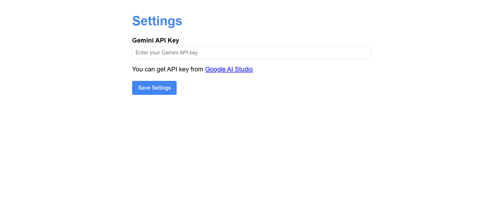
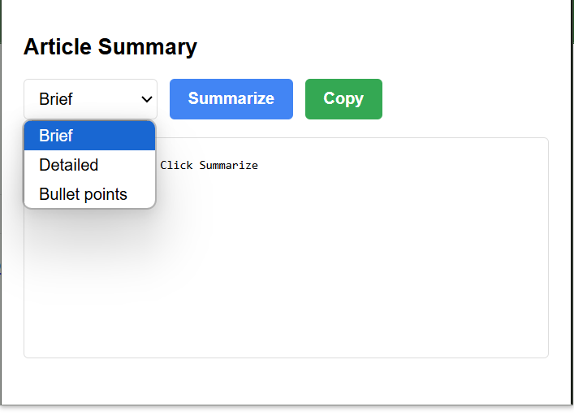

# 📰 Article Summarizer - Chrome Extension

A lightweight and efficient Chrome Extension that summarizes the article content of your current tab using **Gemini API** from Google AI Studio. Choose from **brief**, **detailed**, or **bullet point** summaries, listen to the summary, and copy the result with a single click.

## 🚀 Features

- 🔑 **API Key Setup**  
  Users can input their Gemini API Key via the extension settings page. A link is provided to [Google AI Studio](https://aistudio.google.com/app/apikey) for easy access to get the key.

- 📝 **Summarization Modes**  
  Choose the type of summary you want:
  - **Brief** – A short and concise overview.
  - **Detailed** – A more comprehensive and in-depth summary.
  - **Bullet Points** – Key takeaways in bullet point format.

- 📋 **Copy to Clipboard**  
  Instantly copy the generated summary with the **Copy** button.

- 🔊 **Listen to Summary**  
  Click the **Listen** button to hear the summary read aloud using text-to-speech.

## 📷 Screenshots

### 🔧 Settings Page
Set your Gemini API key to start using the summarizer.

---

### 📄 Popup Interface
Choose summary type, generate summary, listen, and copy it.

## 🛠️ How to Use

1. **Install** the extension in your browser.
2. Click the extension icon and go to **Settings**.
3. **Paste your Gemini API key** (get one from [Google AI Studio](https://aistudio.google.com/app/apikey)).
4. Open any article and click the extension icon.
5. Select the summary type → Click **Summarize**.
6. Click **Listen** to hear the summary.
7. Click **Copy** if needed.
   
## 📦 Tech Stack

- HTML,CSS
- JavaScript
- Google Gemini AI API

## 📄 License

MIT License
